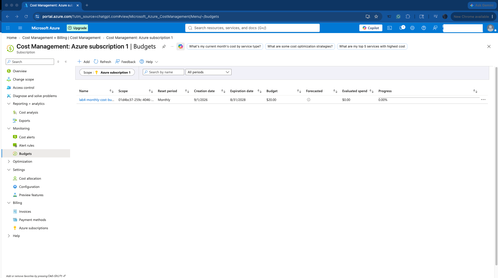
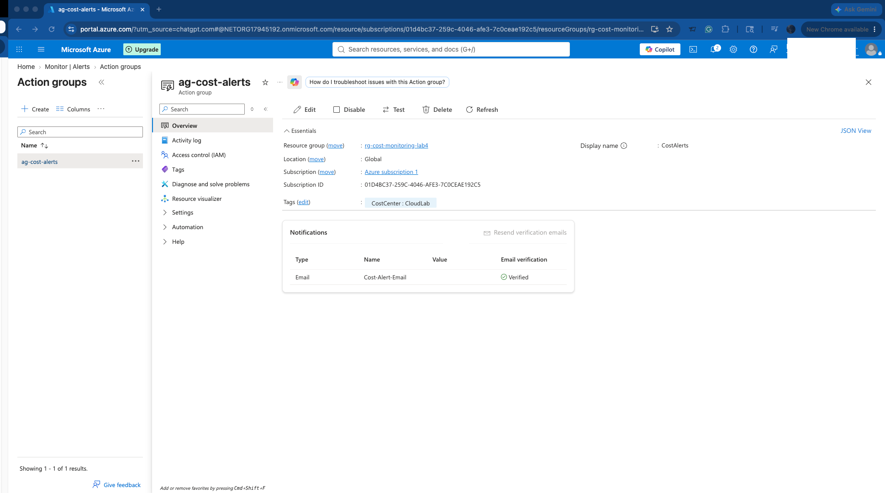
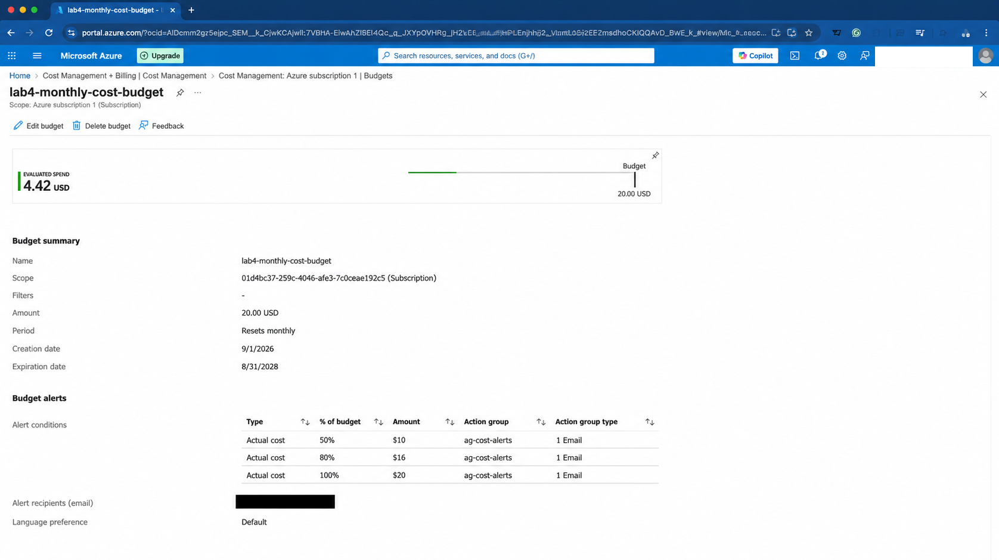
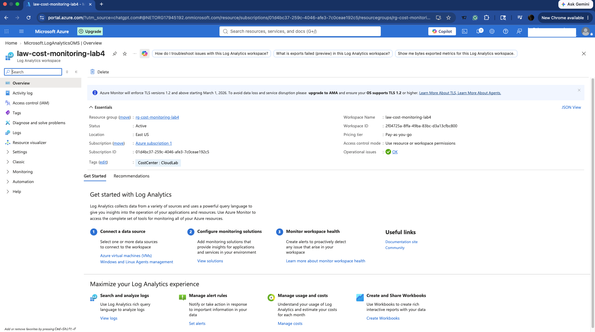
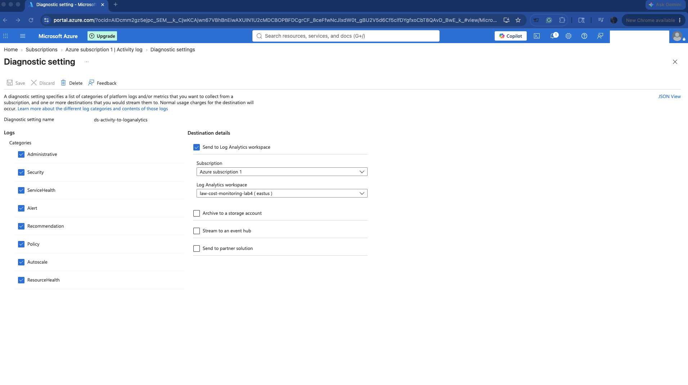
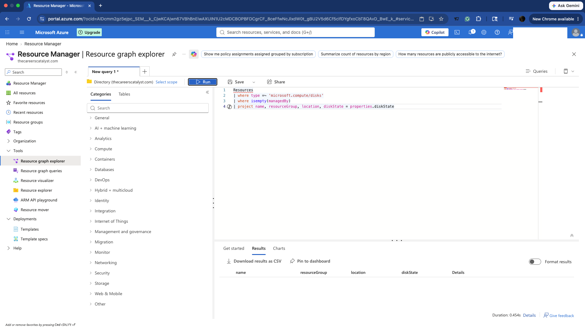
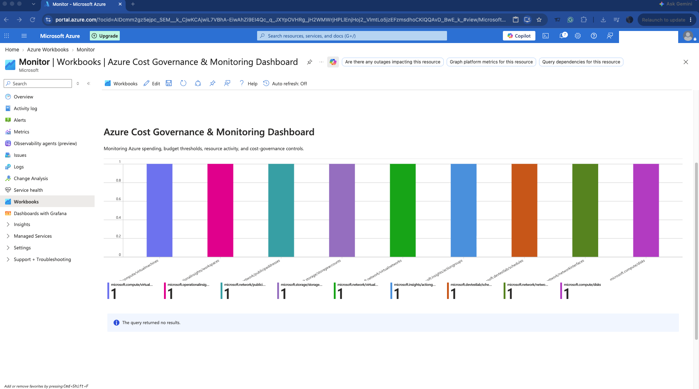

# Azure Cost Governance & Automated Monitoring

## Project Overview

This project implements an Azure cost governance and monitoring solution using Azure Cost Management, Azure Monitor, Log Analytics, Azure Resource Graph, Action Groups, and Azure Workbooks.

The solution provides proactive budget monitoring, automated cost notifications, centralized operational logging, resource optimization queries, policy-based governance, and dashboard visualization across an Azure subscription.

---

## Architecture

The solution follows the following monitoring and governance workflow:

```text
Azure Subscription
│
├── Azure Cost Management
│   └── Monthly Budget ($20)
│       ├── 50% Threshold ($10)
│       ├── 80% Threshold ($16)
│       └── 100% Threshold ($20)
│               │
│               ▼
│       Azure Monitor Action Group
│       └── Automated Email Notification
│
├── Azure Activity Log
│       │
│       ▼
│   Diagnostic Settings
│       │
│       ▼
│   Log Analytics Workspace
│
├── Azure Resource Graph
│   ├── Resource Inventory
│   ├── Unattached Disk Detection
│   └── Unassigned Public IP Detection
│
└── Azure Workbook
    └── Cost Governance & Monitoring Dashboard
```

---

## Technologies Used

- Microsoft Azure
- Azure Cost Management + Billing
- Azure Monitor
- Azure Monitor Action Groups
- Azure Log Analytics
- Azure Activity Log
- Azure Diagnostic Settings
- Azure Resource Graph
- Kusto Query Language (KQL)
- Azure Workbooks
- Azure Policy
- Azure Resource Tags

---

## Cost Management & Budget Monitoring

A monthly Azure budget was configured at the subscription scope to provide proactive visibility into cloud spending.

### Budget Configuration

| Setting | Configuration |
|---|---|
| Budget | $20/month |
| Scope | Azure subscription |
| Reset Period | Monthly |
| 50% Threshold | $10 |
| 80% Threshold | $16 |
| 100% Threshold | $20 |

The three thresholds provide escalating notifications as Azure spending approaches the configured monthly budget.

### Budget Alert Thresholds



---

## Automated Cost Notifications

An Azure Monitor Action Group was created to provide a reusable notification mechanism for cost alerts.

### Action Group Configuration

- **Action Group:** `ag-cost-alerts`
- **Display Name:** `CostAlerts`
- **Resource Group:** `rg-cost-monitoring-lab4`
- **Region:** Global
- **Notification Method:** Email

The Action Group was associated with all three budget thresholds:

- 50%
- 80%
- 100%

This creates an automated notification workflow when spending reaches the configured limits.



### Budget and Action Group Integration



---

## Centralized Logging with Log Analytics

A dedicated Log Analytics workspace was deployed for centralized monitoring and operational telemetry.

### Workspace

`law-cost-monitoring-lab4`

The workspace provides a centralized destination for Azure monitoring data and subscription-level operational logs.



---

## Activity Log Diagnostic Settings

Azure subscription Activity Logs were configured to send supported log categories to the Log Analytics workspace through a diagnostic setting.

The configuration establishes the following telemetry pipeline:

```text
Azure Subscription
        │
        ▼
Azure Activity Log
        │
        ▼
Diagnostic Setting
        │
        ▼
Log Analytics Workspace
```

Supported Activity Log categories were selected for forwarding to the workspace, including administrative, security, policy, service health, alert, recommendation, autoscale, and resource health events.



---

## Azure Resource Graph & Resource Optimization

Azure Resource Graph was used to query the subscription inventory and identify resources that could represent unnecessary cloud spending.

### Resource Inventory Query

```kusto
Resources
| summarize ResourceCount=count() by type
| order by ResourceCount desc
```

This query provides a subscription-level inventory by Azure resource type.

The query is stored in:

`queries/resource-inventory.kql`

### Unattached Managed Disk Detection

```kusto
Resources
| where type =~ 'microsoft.compute/disks'
| where isempty(managedBy)
| project name, resourceGroup, location, diskState = properties.diskState
```

Managed disks that are no longer attached to workloads can continue generating storage costs. This query provides a method for identifying potential cleanup candidates.

The query is stored in:

`queries/unused-disks.kql`

During testing, no managed disks matched the unattached-resource criteria.



### Unassigned Public IP Detection

The environment was also evaluated for Public IP resources without an associated IP configuration.

```kusto
Resources
| where type =~ 'microsoft.network/publicipaddresses'
| where isempty(properties.ipConfiguration)
| project name, resourceGroup, location, ipAddress = properties.ipAddress
```

At the time of testing, no matching unassigned Public IP resources were present.

---

## Azure Cost Governance & Monitoring Dashboard

An Azure Workbook was created to provide a centralized visualization layer for the environment.

The workbook incorporates Azure Resource Graph data to provide visibility into the subscription's resource footprint and cost-governance checks.

### Dashboard Capabilities

- Resource inventory visualization
- Resource counts by Azure resource type
- Unattached managed disk detection
- Unassigned Public IP detection
- Centralized governance monitoring view



---

## Cost Governance Strategy

The solution implements multiple layers of Azure governance.

### Prevent

Azure Policy and required resource tags enforce organizational deployment standards.

### Monitor

Azure Monitor, Log Analytics, Activity Logs, Resource Graph, and Workbooks provide visibility into the Azure environment.

### Alert

Azure Cost Management budgets and Action Groups provide proactive notifications as spending approaches defined limits.

### Optimize

Resource Graph queries identify potential cleanup candidates such as unattached disks and unassigned Public IP addresses.

This creates a governance lifecycle of:

```text
Prevent → Monitor → Alert → Optimize
```

---

## Azure Policy & Resource Tagging

The environment operates under an Azure Policy requiring resources to contain a `CostCenter` tag.

Resources created for this project were configured with:

```text
CostCenter = CloudLab
```

This demonstrates how cost-management practices can be combined with Azure governance controls to support resource organization, accountability, and cost allocation.

---

## Challenges & Resolutions

### Microsoft.Insights Resource Provider

The initial Azure Monitor Action Group deployment failed because the subscription had not registered the `Microsoft.Insights` resource provider.

The provider was registered at the subscription level, after which the Action Group deployed successfully.

### Azure Policy Enforcement

Initial deployment of the Log Analytics workspace was blocked by the existing Azure Policy requiring a `CostCenter` resource tag.

The workspace configuration was updated with:

```text
CostCenter = CloudLab
```

The deployment was then successfully completed while remaining compliant with the governance requirement.

### Log Analytics Data Availability

Initial Log Analytics queries returned no results because the newly created workspace did not yet contain relevant ingested telemetry.

Subscription Activity Logs were subsequently configured through diagnostic settings to send supported log categories to the Log Analytics workspace.

### Resource Optimization Validation

Resource Graph queries for unattached managed disks and unassigned Public IP addresses returned no matching resources during testing.

The queries executed successfully and confirmed that no resources matching those optimization criteria existed at the time of evaluation.

---

## Security & Governance Considerations

The implementation incorporates several Azure governance practices:

- Subscription-level budget monitoring
- Automated threshold notifications
- Reusable Azure Monitor Action Groups
- Centralized operational logging
- Subscription Activity Log forwarding
- Azure Policy enforcement
- Required cost-allocation tagging
- Resource inventory monitoring
- Detection of potential orphaned resources
- Centralized dashboard visualization

---

## Skills Demonstrated

- Azure Cost Management
- Azure budget configuration
- Automated cost alerting
- Azure Monitor Action Groups
- Log Analytics workspace configuration
- Azure Activity Log monitoring
- Diagnostic settings
- Azure Resource Graph
- Kusto Query Language (KQL)
- Azure Workbooks
- Azure Policy compliance
- Resource tagging
- Cloud cost optimization
- Azure troubleshooting

---

## Repository Structure

```text
azure-cost-governance-monitoring/
│
├── queries/
│   ├── resource-inventory.kql
│   └── unused-disks.kql
│
├── 01-budget-alert-thresholds.png
├── 02-action-group-configuration.png
├── 03-log-analytics-workspace.png
├── 04-resource-graph-unused-resource-query.png
├── 05-activity-log-diagnostic-setting.png
├── 06-budget-action-group-alerts.png
├── 07-cost-monitoring-dashboard.png
│
└── README.md
```

---

## Project Outcome

Implemented an Azure cost governance and monitoring solution integrating:

**Cost Management → Budget Controls → Automated Alerting → Centralized Logging → Resource Analysis → Policy Governance → Monitoring Visualization**

The project demonstrates how Azure-native governance and monitoring services can be combined to provide proactive cost visibility, operational monitoring, policy compliance, and resource optimization across an Azure subscription.
